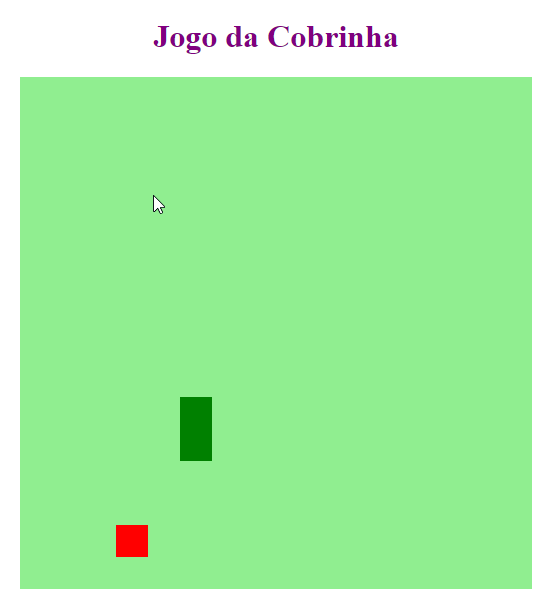

# 🕹 Jogo Snake
> Criando o jogo Snake em Javascript

## 📋 Índice
- [Link do projeto:](https://finandolopes.github.io/snake/)

- [📖 Sobre](#-Sobre)
- [🚀 Tecnologias utilizadas](#-Tecnologias-utilizadas)
- [🖥 Preview](#-Preview)

## 📖 Sobre
 - Aula DIO - Requisitando dados de uma API de criptomoedas

## 🚀 Tecnologias utilizadas
- `HTML`
- `JAVASCRIPT`
- `CSS`

## 🖥 Preview:

  

   

